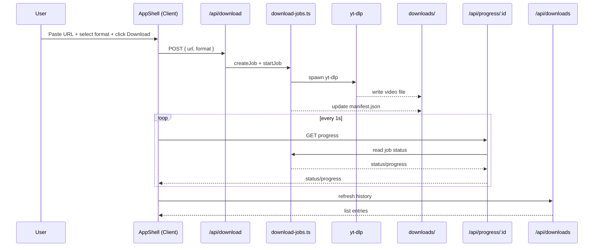
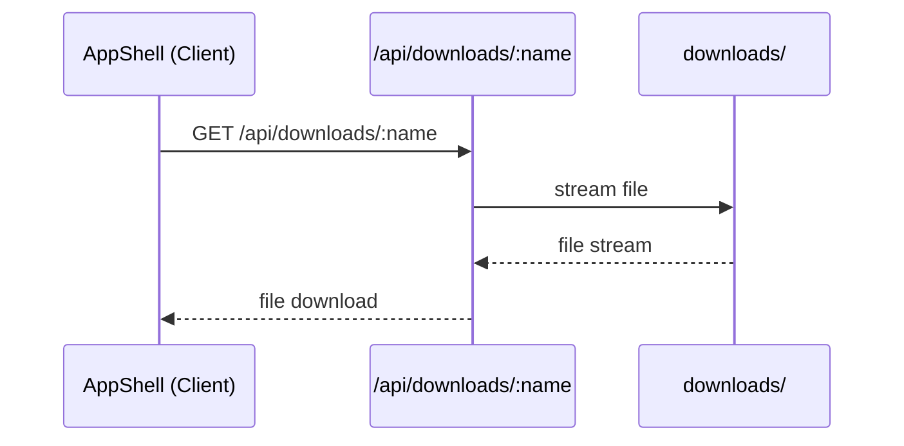

# Architecture & Flow

## Overview
This project is a Next.js (App Router) web application that runs a server-side YouTube download pipeline using `yt-dlp` and exposes progress, history, and file download APIs to a React UI.

## High-Level Architecture

```mermaid
flowchart LR
  U[User / Browser] -->|UI actions| UI[AppShell UI]
  UI -->|POST /api/download| DL[Download API]
  UI -->|GET /api/progress/:id| PR[Progress API]
  UI -->|GET /api/downloads| HS[History API]
  UI -->|GET /api/downloads/:name| FD[File Download API]

  DL --> JM[Job Manager
(download-jobs.ts)]
  JM --> YT[yt-dlp exec]
  YT --> FS[(downloads/)]
  JM --> MF[(manifest.json)]

  HS --> MF
  FD --> FS
  PR --> JM
```

## Data Flow (Download)



## Data Flow (Download File to User)



## Core Modules

### Client UI
- `web/src/components/app-shell.tsx`
  - GNB, 설정 패널, 언어(EN/KR/JP), 테마 토글
  - URL 입력, 포맷 선택, 폴더 선택, 다운로드/중지
  - 진행률 표시(Progress) + 상태 신호등
  - 히스토리 리스트 + 파일 다운로드 링크

### Server APIs
- `web/src/app/api/download/route.ts`
  - 다운로드 작업 생성
- `web/src/app/api/progress/[id]/route.ts`
  - 작업 진행률 조회
- `web/src/app/api/cancel/[id]/route.ts`
  - 작업 중지
- `web/src/app/api/downloads/route.ts`
  - 히스토리 조회
- `web/src/app/api/downloads/[name]/route.ts`
  - 파일 스트리밍 다운로드 (한글 파일명 지원)

### Job Manager
- `web/src/lib/download-jobs.ts`
  - 작업 생성/상태 관리
  - `yt-dlp` 실행 및 출력 파싱
  - 진행률 업데이트/중지 처리
  - `manifest.json` 기록

## Runtime Notes
- 다운로드 파일 저장 위치: `web/downloads/`
- 히스토리 저장: `web/downloads/manifest.json`
- `Audio Only (MP3)`는 `ffmpeg` 필요
- 폴더 선택은 Chrome/Edge + localhost에서 동작
